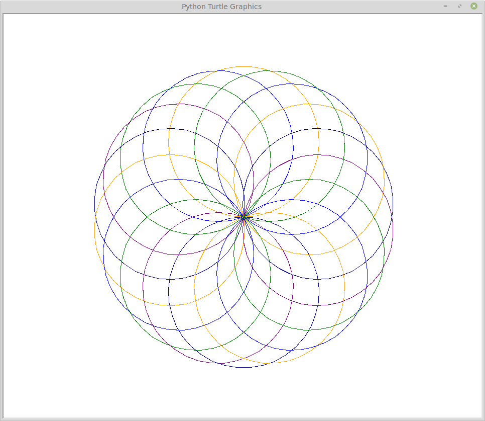
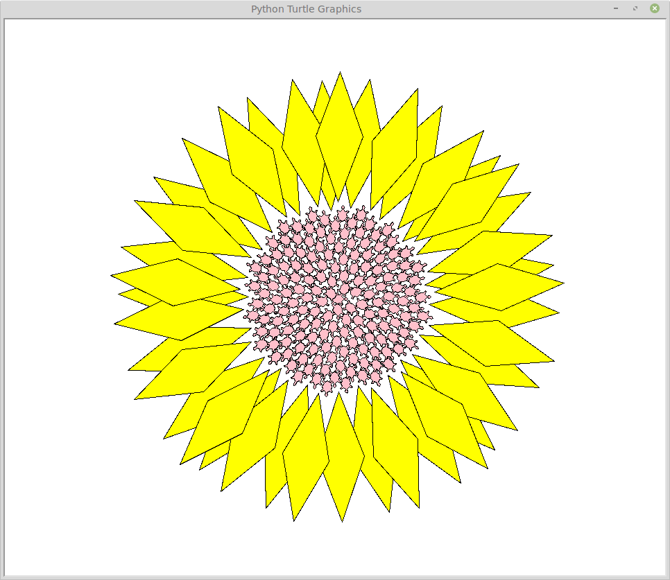
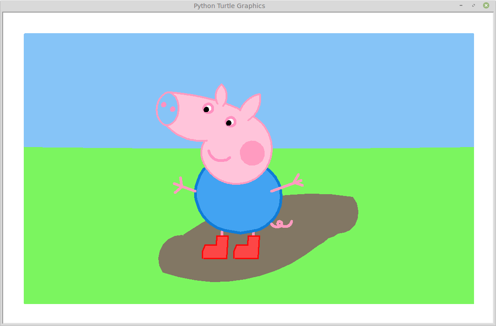

# Pyton Turtle Drawing

本项目包含了Python Turtle画图的例子程序，从基础的用法到高级的绘图技巧，让初学者能通过充满乐趣的画图来学习Python编程，以及编程思维。

## 1. [Gallery](gallery.md)

### 1.1 Basic Usage
code: [0_line](codes/0_line.py)

code: [0_squre](codes/0_squre.py)

code: [0_staircase](codes/0_staircase.py)

code: [0_turtleStar](codes/0_turtleStar.py)

### 1.2 Basic Shapes
code: [1_basicShapes](codes/1_basicShapes.py)

code: [1_colorLines](codes/1_colorLines.py)

code: [1_fillRectangle](codes/1_fillRectangle.py)

code: [1_squares](codes/1_squares.py)

code: [1_sun](codes/1_sun.py)

code: [1_chessBoard](codes/1_chessBoard.py)

code: [1_taiji](codes/1_taiji.py)

### 1.3 Repeat Drawing
code: [2_colorCircles](codes/2_colorCircles.py)

code: [2_colorHexagon](codes/2_colorHexagon.py)

code: [2_colorHexspial](codes/2_colorHexspial.py)

code: [2_colorRay1](codes/2_colorRay1.py)

code: [2_colorRay2](codes/2_colorRay2.py)

code: [2_colorRay3](codes/2_colorRay3.py)

code: [2_colorWave](codes/2_colorWave.py)

code: [2_georgiaSpirals](codes/2_georgiaSpirals.py)

code: [2_momaMaterial](codes/2_momaMaterial.py)

code: [2_moroccanMosaic](codes/2_moroccanMosaic.py)

code: [2_moroccanMosaic2](codes/2_moroccanMosaic2.py)

code: [2_race](codes/2_race.py)

code: [2_shellSpiral](codes/2_shellSpiral.py)

code: [2_stars](codes/2_stars.py)

code: [2_sunFlower](codes/2_sunFlower.py)

code: [2_turtleSpiral](codes/2_turtleSpiral.py)

### 1.4 Spirograph
code: [3_fractalSpirograph](codes/3_fractalSpirograph.py)

code: [3_spirograph](codes/3_spirograph.py)

code: [3_spirographHypotrochoid](codes/3_spirographHypotrochoid.py)

### 1.5 Fractal & Math
code: [4_fractalTree](codes/4_fractalTree.py)

code: [4_fractalTree2](codes/4_fractalTree2.py)

code: [4_hypercube](codes/4_hypercube.py)

code: [4_leaf](codes/4_leaf.py)

code: [4_sierpinskiTriangle](codes/4_sierpinskiTriangle.py)

code: [4_cherryFlower](codes/4_cherryFlower.py)

code: [4_cherryFlower2](codes/4_cherryFlower2.py)

code: [4_cherryFlower3](codes/4_cherryFlower3.py)

code: [4_christmasTree](codes/4_christmasTree.py)

### 1.6 Complex Drawing
code: [5_colorSnake](codes/5_colorSnake.py)

code: [5_doraemon](codes/5_doraemon.py)

code: [5_doraemon2](codes/5_doraemon2.py)

code: [5_doraemon3](codes/5_doraemon3.py)

code: [5_flower](codes/5_flower.py)

code: [5_flower2](codes/5_flower2.py)

code: [5_landscape](codes/5_landscape.py)

code: [5_littleYellowMan](codes/5_littleYellowMan.py)

code: [5_loveHeart](codes/5_loveHeart.py)

code: [5_rainbow](codes/5_rainbow.py)

code: [5_redFlag](codes/5_redFlag.py)

code: [5_snowFlower](codes/5_snowFlower.py)

code: [5_starCircle](codes/5_starCircle.py)

code: [5_turtleSunflower](codes/5_turtleSunflower.py)

code: [5_patrickStar](codes/5_patrickStar.py)

code: [5_peppaPig](codes/5_peppaPig.py)

code: [5_peppaPig2](codes/5_peppaPig2.py)

code: [5_peppaPig3](codes/5_peppaPig3.py)

code: [5_pikachu](codes/5_pikachu.py)

code: [5_pikachu2](codes/5_pikachu2.py)

## [References](docs/referenes.md)
[References](docs/referenes.md)
